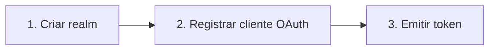
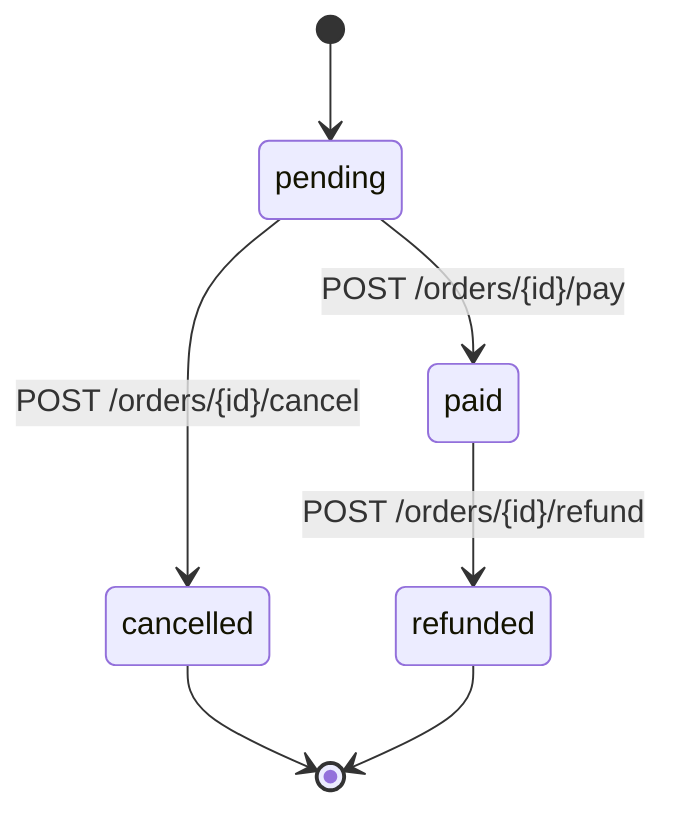

# RFC — Elevando a documentação das APIs Swepay via Native.OpenApi

> **Status:** Draft · **Autor:** Alex + agente UX Writer · **Data:** 2026-04-16
> **Escopo:** `native-open-api` + `NativeLambdaRouter.SourceGenerator.OpenApi`
> **Audiência-alvo das APIs documentadas:** devs externos / parceiros Swepay

---

## 1. Contexto

A `native-open-api` é consumida pelas APIs do ecossistema Swepay (admin, identity, openid, payments, etc.) para:

1. Gerar o `openapi.json` / `openapi.yaml` em **compile-time**, via Source Generator, a partir dos endpoints `MapGet/MapPost/...` do `NativeLambdaRouter`.
2. **Mesclar** specs parciais (commons + per-function) em um documento consolidado.
3. **Servir** a documentação renderizada via **Redoc** e **Scalar** (HTML estático via `OpenApiHtmlRenderer`).
4. **Lintar** specs com regras configuráveis em `OpenApiLinter`.

Hoje, a cobertura funcional é sólida — há metadata (`WithName`, `WithSummary`, `[EndpointDescription]`), respostas (`[ApiResponse]`, `.ProducesProblem()`), schemas introspectados via Roslyn, Native AOT end-to-end. Mas, da ótica de um **parceiro externo que integra uma API Swepay pela primeira vez**, falta:

- Controle fino de **visibilidade** (há endpoints internos vazando na doc pública).
- Narrativa de **fluxo**: como encadear chamadas para realizar uma jornada (ex.: onboarding de realm → emissão de token → primeira chamada autenticada).
- **Máquina de estados** dos recursos (ex.: `pending → paid → refunded` de Order).
- **Exemplos ricos e nomeados** por cenário (happy path, validação, conflito).
- **Catálogo de erros** com causa, mensagem user-friendly e ação de recuperação.
- **Branding Swepay** nos renderers Redoc/Scalar.
- Hints de **idempotência, rate limit, deprecation** declarativos.

Este RFC propõe um catálogo priorizado de features na biblioteca, com API-surface proposta em C#, extensões OpenAPI 3.1 (`x-swepay-*`), impactos nos renderers e plano de ondas.

---

## 2. Objetivos

- **O1** — Dar aos devs das APIs Swepay verbos declarativos para esconder, agrupar, documentar estados e fluxos de endpoints sem sair do C#.
- **O2** — Enriquecer o `openapi.json` gerado com extensões customizadas que os renderers (Redoc/Scalar) e ferramentas de terceiros (Postman, Stoplight, IDEs) possam consumir.
- **O3** — Oferecer templates Redoc/Scalar com branding Swepay, navegação pensada para parceiros, footer institucional e suporte a diagramas Mermaid.
- **O4** — Manter **100% Native AOT, zero reflection em runtime**. Toda introspecção acontece via Roslyn em compile-time.
- **O5** — Retrocompatibilidade total: APIs existentes não podem quebrar ao atualizar o pacote. Todas as features são opt-in.

## 3. Não-objetivos

- Não substituir ferramentas de contract testing (Pact, etc.).
- Não gerar SDKs (delegado a `openapi-generator` / scripts próprios).
- Não implementar runtime hot-reload da spec (a spec é constante imutável em compile-time, by design).
- Não suportar OpenAPI 3.0 — Swepay é 3.1-only.

---

## 4. Princípios UX Writing (para quem vai usar as features)

Estes princípios viram a régua do agente UX Writer (seção 8) e do `OpenApiLinter` (regras novas):

1. **Uma operação = um verbo + um objeto.** `CreateOrder`, não `ManageOrders`. Se precisa de dois verbos, vira duas operações.
2. **Summary ≤ 60 caracteres**, em imperativo ou descritivo consistente em toda a API: `"Create an order"` ou `"Creates an order"` — escolha uma e trave.
3. **Description abre com o "o quê", prossegue com o "quando usar" e termina com "cuidados/limites".** Nunca repita o summary.
4. **Exemplos são reais.** Nada de `foo/bar/baz`. Use dados plausíveis do domínio (valores em BRL, CNPJ formatado, realms com nomes de clientes-exemplo).
5. **Toda resposta de erro declara: causa, mensagem UX, próximo passo.** `problem+json` não é lixão de stack trace.
6. **IDs têm formato documentado.** Prefixo + ULID/UUID. Ex.: `ord_01JRX8F...`. Documente em `components.schemas` e cite na description.
7. **Timestamps são sempre ISO-8601 com timezone.** `2026-04-16T12:34:56-03:00`, nunca epoch cru sem documentação.
8. **Nunca exponha detalhes internos** em erros públicos: stack traces, nomes de tabelas, mensagens do SGBD, chaves internas.
9. **Deprecation é contrato.** Sempre tem data de sunset e alternativa apontada. Banner no Redoc, não apenas flag no YAML.
10. **Consistência > criatividade.** O mesmo conceito tem o mesmo nome em toda a API (não misture `customerId` e `clientId` para o mesmo campo).

---

## 5. Catálogo de features

Legenda: **P0** = bloqueante do MVP · **P1** = segunda onda · **P2** = backlog. Esforço: **S** (≤ 1 dia) · **M** (2–5 dias) · **L** (> 1 semana).

### 5.1 Visibilidade e governança

#### F01 · `[HideFromDocs]` / `.ExcludeFromDocs()` — P0 · S

Esconde uma operação do YAML gerado (e, por consequência, de Redoc/Scalar).

```csharp
// Atributo no TCommand
[HideFromDocs]
public sealed record InternalHealthCommand(string Secret);

// Fluent chain
routes.MapGet<InternalHealthCommand, HealthResponse>("/internal/health", ...)
    .ExcludeFromDocs();
```

**Impacto no YAML:** a operação simplesmente não é emitida. Se todos os métodos de um path são ocultados, o próprio path some.

**Alternativa considerada:** `[ApiExplorerSettings(IgnoreApi = true)]` do ASP.NET Core. Rejeitada: dependência externa desnecessária e nomenclatura pouco descritiva.

#### F02 · `[Audience("public", "partner")]` / `.ForAudience(...)` — P1 · M

Permite gerar **múltiplas views** de uma mesma spec por audiência. O consumidor da biblioteca escolhe qual audiência renderizar no endpoint `/docs/*`.

```csharp
[Audience(ApiAudience.Public, ApiAudience.Partner)]
public sealed record CreateOrderCommand(...);

[Audience(ApiAudience.Internal)]
public sealed record ForceRefundCommand(...);
```

**Impacto no YAML:** emite `x-swepay-audience: [public, partner]` em cada operação. A pipeline de merge aceita parâmetro `audience` e filtra antes de escrever no disco.

**Impacto no renderer:** `OpenApiHtmlRenderer` ganha sobrecarga que recebe `audience` e aponta para a spec pré-filtrada.

#### F03 · `[Deprecated(sunset, alternative)]` — P0 · S

Hoje o usuário tem que editar manualmente o YAML para marcar `deprecated: true` e adicionar `x-sunset`. Proposta:

```csharp
[Deprecated(
    sunset: "2026-12-31",
    alternative: "POST /v2/orders",
    reason: "v1 não suporta split de parcelas")]
public sealed record CreateOrderV1Command(...);
```

**Impacto no YAML:**

```yaml
deprecated: true
x-sunset: "2026-12-31"
x-swepay-alternative: "POST /v2/orders"
x-swepay-deprecation-reason: "v1 não suporta split de parcelas"
```

**Impacto no renderer:** Redoc já respeita `deprecated`. O template custom injeta um banner amarelo com a data, a alternativa e o motivo — copy do banner controlado pelo UX Writer.

#### F04 · `[Stability(Stability.Experimental)]` — P1 · S

Quatro níveis: `Experimental`, `Beta`, `Stable`, `Deprecated` (este último se sobrepõe a F03).

**Impacto no YAML:** `x-swepay-stability: experimental`.

**Impacto no renderer:** badge colorido ao lado do summary (roxo/experimental, amarelo/beta, verde/stable).

---

### 5.2 Fluxo e semântica

#### F05 · `[Flow(name, step, after?)]` / `.InFlow(...)` — P0 · L

Declara que uma operação participa de uma **jornada multi-step**. Exemplo canônico: onboarding de realm.

```csharp
[Flow("onboarding", step: 1)]
public sealed record CreateRealmCommand(string Name, string Owner);

[Flow("onboarding", step: 2, after: nameof(CreateRealmCommand))]
public sealed record RegisterFirstClientCommand(string RealmId, ...);

[Flow("onboarding", step: 3, after: nameof(RegisterFirstClientCommand))]
public sealed record IssueServiceAccountTokenCommand(string ClientId, ...);
```

**Impacto no YAML:** extensão `x-swepay-flows` na raiz:

```yaml
x-swepay-flows:
  onboarding:
    title: "Onboarding de Realm"
    description: "Do provisioning ao primeiro token autenticado"
    steps:
      - operationId: createRealm
        title: "1. Criar realm"
      - operationId: registerFirstClient
        title: "2. Registrar cliente OAuth"
        after: createRealm
      - operationId: issueServiceAccountToken
        title: "3. Emitir token"
        after: registerFirstClient
```

**Impacto no renderer:** tab `Flows` no Redoc (injetada via JS no template custom) que renderiza um diagrama **Mermaid** do fluxo e, por passo, link para a operação, copy UX-written e um `curl` encadeado.



#### F06 · `[StateMachine(typeof(OrderState))]` — P0 · L

Declara a máquina de estados de um recurso. O enum/record descreve estados e transições; a biblioteca gera o diagrama.

```csharp
public enum OrderState { Pending, Paid, Cancelled, Refunded }

[StateMachine(typeof(OrderState))]
[StateTransition(OrderState.Pending, OrderState.Paid, via: "POST /orders/{id}/pay")]
[StateTransition(OrderState.Pending, OrderState.Cancelled, via: "POST /orders/{id}/cancel")]
[StateTransition(OrderState.Paid, OrderState.Refunded, via: "POST /orders/{id}/refund")]
public sealed record OrderResponse(string Id, OrderState State, decimal Amount);
```

**Impacto no YAML:**

```yaml
components:
  schemas:
    OrderResponse:
      x-swepay-state-machine:
        field: state
        states: [pending, paid, cancelled, refunded]
        initial: pending
        terminal: [cancelled, refunded]
        transitions:
          - from: pending
            to: paid
            trigger: "POST /orders/{id}/pay"
```

**Impacto no renderer:** bloco de diagrama stateDiagram-v2 do Mermaid injetado na página do schema:



#### F07 · `[Idempotent(header, ttl)]` — P1 · S

Declara que um endpoint é idempotente e exige header.

```csharp
[Idempotent(headerName: "Idempotency-Key", ttlSeconds: 86400)]
public sealed record CreatePaymentCommand(...);
```

**YAML:** adiciona parâmetro `header` obrigatório + `x-swepay-idempotency`. Renderer mostra selo "Idempotent" ao lado do método.

#### F08 · `[RateLimit(requests, per, scope)]` — P1 · S

```csharp
[RateLimit(requests: 100, per: RateLimitWindow.Minute, scope: RateLimitScope.ApiKey)]
public sealed record SearchOrdersCommand(...);
```

**YAML:** `x-swepay-rate-limit: { requests: 100, per: minute, scope: api-key }`. Renderer adiciona bloco "Rate limiting" na sidebar.

---

### 5.3 Exemplos ricos

#### F09 · `[ApiExample(name, summary, requestJson?, responseJson?)]` — P0 · M

Múltiplos exemplos **nomeados** por cenário para o mesmo endpoint, alinhados ao `content.examples` do OpenAPI 3.1.

```csharp
[ApiExample(
    name: "happy-path",
    summary: "Pedido simples com 1 item",
    requestJson: "examples/create-order/happy.json",
    responseStatus: 201,
    responseJson: "examples/create-order/happy-response.json")]
[ApiExample(
    name: "split-payment",
    summary: "Pedido com split entre lojista e marketplace",
    requestJson: "examples/create-order/split.json")]
[ApiExample(
    name: "validation-error",
    summary: "CNPJ inválido",
    responseStatus: 422,
    responseJson: "examples/create-order/invalid-cnpj.json")]
public sealed record CreateOrderCommand(...);
```

Os arquivos vivem em embedded resources (`<EmbeddedResource Include="examples\**\*.json" />`) e o Source Generator lê em compile-time, validando o JSON contra o schema via `OpenApiLinter`. Exemplo inválido = build quebra.

#### F10 · `IExampleProvider<T>` — P1 · M

Para exemplos gerados por código (e.g., IDs ULID plausíveis, datas relativas):

```csharp
public sealed class CreateOrderExamples : IExampleProvider<CreateOrderCommand>
{
    public IReadOnlyList<NamedExample<CreateOrderCommand>> GetExamples() => new[]
    {
        new NamedExample<CreateOrderCommand>(
            name: "happy-path",
            summary: "Pedido simples",
            value: new CreateOrderCommand(
                CustomerId: "cus_01JRX8F9M2N0P",
                Amount: 12990,
                Currency: "BRL",
                Items: [new OrderItem("sku_001", 1, 12990)])),
    };
}
```

O Source Generator descobre implementações de `IExampleProvider<T>` e as serializa em build-time (Native AOT-safe via `JsonSerializerContext`).

#### F11 · `[Callback(name, typeof(TPayload))]` — P2 · L

Documenta webhooks emitidos pela API. OpenAPI 3.1 suporta nativamente `callbacks`, mas hoje o gerador ignora.

---

### 5.4 Erros e recovery

#### F12 · `[ErrorCatalog(typeof(SwepayErrors))]` — P0 · M

Uma classe central declara todos os códigos de erro do ecossistema:

```csharp
public static class SwepayErrors
{
    [ErrorDefinition(
        code: "PAYMENT_INSUFFICIENT_FUNDS",
        httpStatus: 402,
        userMessage: "Saldo insuficiente no método de pagamento.",
        recovery: "Tente outro método de pagamento ou adicione saldo.",
        docUrl: "https://docs.swepay.com.br/errors/PAYMENT_INSUFFICIENT_FUNDS")]
    public const string PaymentInsufficientFunds = "PAYMENT_INSUFFICIENT_FUNDS";

    [ErrorDefinition(
        code: "REALM_NOT_FOUND",
        httpStatus: 404,
        userMessage: "Realm não encontrado.",
        recovery: "Verifique o realmId ou consulte GET /v1/realms.")]
    public const string RealmNotFound = "REALM_NOT_FOUND";
}

[ErrorCatalog(typeof(SwepayErrors))]
public sealed record CreatePaymentCommand(...);
```

**Impacto no YAML:** extensão `x-swepay-errors` na operação, listando os códigos declarados e, na raiz, `x-swepay-error-catalog` com todos os detalhes.

**Impacto no renderer:** seção dedicada "Error Catalog" no Redoc, em formato de tabela filtrável, com busca por código.

#### F13 · Enriquecimento de `problem+json` — P0 · S

Padroniza o `ProblemDetails` Swepay com campos extras:

```json
{
  "type": "https://docs.swepay.com.br/errors/PAYMENT_INSUFFICIENT_FUNDS",
  "title": "Payment Insufficient Funds",
  "status": 402,
  "detail": "Saldo insuficiente no método de pagamento.",
  "instance": "/v1/payments/pay_01JRX...",
  "code": "PAYMENT_INSUFFICIENT_FUNDS",
  "recovery": "Tente outro método de pagamento ou adicione saldo.",
  "requestId": "req_01JRX..."
}
```

Schema publicado em `components.schemas.SwepayProblemDetails`. Todas as operações com `.ProducesProblem(...)` referenciam esse schema por padrão.

#### F14 · `[Retryable(strategy, maxAttempts)]` — P2 · S

Hint de retry ao cliente. Declara estratégia (`ExponentialBackoff`, `FixedInterval`, `None`) e limite.

---

### 5.5 Branding e renderers

#### F15 · Branding Swepay configurável — P0 · M

Novos MSBuild properties lidos pelo `OpenApiHtmlRenderer`:

| Property | Default | Uso |
|---|---|---|
| `OpenApiBrandPrimaryColor` | `#1976d2` | cor primária Redoc/Scalar |
| `OpenApiBrandAccentColor` | — | cor secundária (CTAs, badges) |
| `OpenApiBrandLogoUrl` | — | SVG/PNG no header |
| `OpenApiBrandFavicon` | — | `<link rel="icon">` |
| `OpenApiBrandFontFamily` | `Roboto, sans-serif` | tipografia |
| `OpenApiBrandThemeJson` | — | override total de theme (JSON) |

`OpenApiHtmlRenderer` lê esses values via `IConfiguration` / env vars em runtime (mantendo AOT-safe: nada de `AppDomain.CurrentDomain.GetAssemblies()`).

#### F16 · Footer institucional — P0 · S

Footer fixo no Redoc/Scalar com links: **Status Page · Support · Changelog · SLA · Terms**. URLs configuradas via MSBuild (`OpenApiFooterStatusUrl`, etc.) ou `OpenApiHtmlRendererOptions`.

Copy do footer sob custódia do UX Writer (seção 8).

#### F17 · Injeção de Mermaid nos renderers — P0 · M

`OpenApiHtmlRenderer` passa a injetar **mermaid.js** e um pré-processador que:

1. Procura blocos ` ```mermaid ` em `description` / `summary` e os renderiza como SVG.
2. Consome `x-swepay-flows` e `x-swepay-state-machine` e gera automaticamente os diagramas.

Scalar hoje tem suporte nativo via `<mermaid>` — basta documentarmos. Redoc exige injeção via JS no template (é viável, arquitetura atual já faz isso com `Redoc.init`).

#### F18 · Code samples multi-linguagem (`x-code-samples`) — P1 · L

Gera snippets por operação em **cURL, C#, TypeScript, Python, Go**. Duas alternativas:

- **A (runtime):** delegar a `openapi-snippet` no lado do Redoc via JS.
- **B (build-time):** gerar snippets via Source Generator a partir do schema + uma lib de template (Scriban/Handlebars em build-time não afeta AOT). Mais controle, copy UX-writável, porém mais trabalho.

Recomendação: começar por **A** (gratuito) e migrar para **B** quando houver folga.

#### F19 · Servers + sandbox "Try it out" — P2 · S

MSBuild properties:

```xml
<OpenApiServerProduction>https://api.swepay.com.br</OpenApiServerProduction>
<OpenApiServerSandbox>https://sandbox.api.swepay.com.br</OpenApiServerSandbox>
```

Vira:

```yaml
servers:
  - url: https://api.swepay.com.br
    description: Production
  - url: https://sandbox.api.swepay.com.br
    description: Sandbox (safe to experiment)
```

Scalar já tem Try-it-out nativo. Redoc não.

---

### 5.6 Info macro / UX

#### F20 · Glossário (`x-swepay-glossary`) — P2 · S

Seção dedicada com termos do domínio (Realm, Service Account, Split, Chargeback, etc.).

#### F21 · Changelog inline (`[Since("1.4.0")]`) — P1 · S

Aplicável em operations, fields e schemas. Agrega em `x-swepay-changelog` na raiz.

#### F22 · Política de breaking change — P1 · XS

Seção `info.description` padrão com política (semver, janela de deprecation, canais de aviso). Vive em Markdown template injetado pelo `OpenApiHtmlRenderer`.

#### F23 · Descrição rica de tags (`[TagDescription]`) — P1 · S

Hoje as tags saem nuas. Proposta:

```csharp
[assembly: TagDescription(
    name: "Orders",
    description: "Pedidos do checkout: criação, consulta, cancelamento.",
    externalDocUrl: "https://docs.swepay.com.br/guides/orders",
    externalDocTitle: "Guia completo de Orders")]
```

#### F24 · Scopes OAuth2 por operação (`[RequiredScope]`) — P1 · M

Granularidade maior que o default "Bearer":

```csharp
[RequiredScope("orders:write")]
public sealed record CreateOrderCommand(...);

[RequiredScope("orders:read")]
public sealed record GetOrderCommand(...);
```

Gera `security: [{ swepayOAuth2: [orders:write] }]`.

#### F25 · Request tracing (`X-Request-Id`) — P2 · S

Header padrão em todas as respostas, documentado automaticamente.

---

## 6. Plano de ondas

### Wave 1 — MVP UX (P0, ~3 semanas)

Objetivo: fechar as lacunas mais dolorosas para parceiros externos.

- F01 — HideFromDocs
- F03 — Deprecated rico
- F09 — Named examples
- F12 — Error catalog
- F13 — ProblemDetails Swepay
- F15 — Branding configurável
- F16 — Footer institucional
- F17 — Mermaid injection

**Critério de aceite da wave:** uma API existente (sugiro `core-identity-management-api`) migrada para usar todos os P0, renderizada com branding e aprovada pelo UX Writer (agente + revisão humana).

### Wave 2 — Fluxo e profundidade (P0 + P1, ~4 semanas)

- F05 — Multi-step flow
- F06 — State machine
- F04 — Stability
- F18 — Code samples (via openapi-snippet)
- F23 — Tag description rica

### Wave 3 — Refinamento (P1, ~3 semanas)

- F02 — Audience targeting
- F07 — Idempotency
- F08 — Rate limit
- F10 — ExampleProvider
- F21 — Changelog inline
- F24 — RequiredScope

### Backlog

F11, F14, F19, F20, F22, F25.

---

## 7. Considerações Native AOT

Toda feature precisa respeitar:

- **Nenhuma reflection em runtime.** Descoberta de atributos/interfaces acontece via Roslyn no Source Generator.
- **Zero dinâmico.** `JsonSerializerContext` estático para qualquer serialização de exemplos/payloads.
- **Resources embedded** para exemplos JSON (já padrão na lib).
- **Strings constantes.** Onde possível, gerar `const string` em vez de `static readonly string` — trim-friendly.
- **Geração determinística.** Mesmo input = mesmo output (`AnalyzerReleases.Shipped.md` já trata). Ordenação de chaves em YAML é lexicográfica nos pontos onde a ordem não é semântica.

Risco: **Mermaid.js via CDN** em Redoc/Scalar adiciona dependência externa. Mitigação: permitir inline do JS via MSBuild (`OpenApiInlineAssets=true`) para ambientes air-gapped.

---

## 8. Agente UX Writer (skill)

Criado em `/mnt/.claude/skills/api-ux-writer/SKILL.md` — documento irmão deste RFC.

O agente:

1. Recebe um `openapi.json` (ou path de projeto C# Swepay).
2. Executa checklist das 10 heurísticas da seção 4.
3. Produz um **relatório de issues** por operation/schema (formato reviewer-friendly).
4. Sugere redação alternativa para summaries, descriptions, error messages.
5. Valida se metadata das features deste RFC está bem aplicada (F01–F25).

Invocar com `/skill api-ux-writer` + path da spec.

---

## 9. API surface consolidada (referência rápida)

Novos atributos em `Native.OpenApi` (namespace `Native.OpenApi.Attributes`):

```csharp
[HideFromDocs]
[Deprecated(sunset, alternative, reason)]
[Stability(Stability.Experimental|Beta|Stable)]
[Audience(params ApiAudience[])]
[Flow(name, step, after?)]
[StateMachine(typeof(TEnum))]
[StateTransition(from, to, via)]
[Idempotent(headerName, ttlSeconds)]
[RateLimit(requests, per, scope)]
[ApiExample(name, summary, ..., requestJson?, responseJson?)]
[Callback(name, typeof(TPayload))]
[ErrorCatalog(typeof(TCatalog))]
[ErrorDefinition(code, httpStatus, userMessage, recovery, docUrl?)]
[Retryable(strategy, maxAttempts)]
[Since(version)]
[RequiredScope(params string[])]
[TagDescription(name, description, externalDocUrl?, externalDocTitle?)] // assembly-level
```

Novos fluent extensions em `IRouteBuilder`:

```csharp
.ExcludeFromDocs()
.InFlow(name).Step(n).After(operationName)
.WithStability(Stability.Beta)
.ForAudience(ApiAudience.Partner)
.WithIdempotency(headerName, ttl)
.WithRateLimit(requests, per, scope)
.WithExample(name, summary, request, response?)
.WithRequiredScope(params string[])
```

Novas MSBuild properties (CompilerVisibleProperty):

```
OpenApiBrandPrimaryColor
OpenApiBrandAccentColor
OpenApiBrandLogoUrl
OpenApiBrandFavicon
OpenApiBrandFontFamily
OpenApiBrandThemeJson
OpenApiFooterStatusUrl
OpenApiFooterSupportUrl
OpenApiFooterChangelogUrl
OpenApiFooterSlaUrl
OpenApiFooterTermsUrl
OpenApiServerProduction
OpenApiServerSandbox
OpenApiInlineAssets (bool)
OpenApiDefaultAudience
```

---

## 10. Open questions

1. **Filtro de audience (F02)** — gerar uma spec por audience em build-time (3 arquivos) ou uma spec única + filtro em runtime no `OpenApiDocumentProvider`? Trade-off: storage vs. complexidade de runtime AOT.
2. **Mermaid no Redoc** — injetar via postMessage/MutationObserver (atual) ou fork do template? Fork dá mais controle mas custo de manutenção.
3. **Error catalog cross-assembly** — `SwepayErrors` mora em uma lib compartilhada (`core-something`) ou cada API define o seu? Votação: compartilhada (consistência > autonomia).
4. **`[ApiExample]`** — suportar `requestJson` como literal JSON string além de path? Pode virar ruído; proponho path-only.
5. **Breaking change policy (F22)** — copy do texto em PT-BR, EN ou ambos? (Parceiros são majoritariamente BR, mas há integração global.)

---

## 11. Próximos passos

1. **Revisão** deste RFC com time de API (prazo sugerido: 2026-04-23).
2. **Skill UX Writer** funcional — já entregue junto com este RFC em `/mnt/.claude/skills/api-ux-writer/`.
3. **Wave 1 kickoff** após aprovação: tickets separados por feature (F01/F03/F09/F12/F13/F15/F16/F17), prefixo `NOA-` no tracker.
4. **Piloto** em `core-identity-management-api` antes do rollout global.

---

## Apêndice A — Exemplo end-to-end (Wave 1 aplicada)

Antes (estado atual):

```csharp
public sealed record CreateRealmCommand(string Name, string Owner);

routes.MapPost<CreateRealmCommand, CreateRealmResponse>("/v1/realms", ...)
    .WithTags("Realms")
    .WithSummary("Creates a realm");
```

Depois (com P0 aplicados):

```csharp
[ApiExample("happy-path", "Realm simples",
    requestJson: "examples/create-realm/happy.json",
    responseStatus: 201,
    responseJson: "examples/create-realm/happy-response.json")]
[ApiExample("duplicate-name", "Nome já existe",
    responseStatus: 409,
    responseJson: "examples/create-realm/duplicate.json")]
[ErrorCatalog(typeof(SwepayErrors))]
public sealed record CreateRealmCommand(string Name, string Owner);

// Handler
public class CreateRealmHandler : IRequestHandler<CreateRealmCommand, CreateRealmResponse>
{
    [ApiResponse(201, typeof(CreateRealmResponse), "application/json")]
    [ApiResponse(409, typeof(SwepayProblemDetails), "application/problem+json")]
    [ApiResponse(422, typeof(SwepayProblemDetails), "application/problem+json")]
    public ValueTask<CreateRealmResponse> Handle(CreateRealmCommand r, CancellationToken ct) { ... }
}

// Route
routes.MapPost<CreateRealmCommand, CreateRealmResponse>("/v1/realms", ...)
    .WithTags("Realms")
    .WithName("CreateRealm")
    .WithSummary("Create a realm")
    .WithDescription(
        "Provisiona um novo realm com o dono informado. " +
        "Use quando estiver iniciando a integração de um novo cliente Swepay. " +
        "O nome do realm é imutável após a criação.");
```

E, nos `.csproj`:

```xml
<PropertyGroup>
  <OpenApiBrandPrimaryColor>#0A2540</OpenApiBrandPrimaryColor>
  <OpenApiBrandAccentColor>#00D4AA</OpenApiBrandAccentColor>
  <OpenApiBrandLogoUrl>https://cdn.swepay.com.br/brand/logo-dark.svg</OpenApiBrandLogoUrl>
  <OpenApiFooterStatusUrl>https://status.swepay.com.br</OpenApiFooterStatusUrl>
  <OpenApiFooterSupportUrl>https://docs.swepay.com.br/support</OpenApiFooterSupportUrl>
  <OpenApiFooterChangelogUrl>https://docs.swepay.com.br/changelog</OpenApiFooterChangelogUrl>
  <OpenApiServerProduction>https://api.swepay.com.br</OpenApiServerProduction>
  <OpenApiServerSandbox>https://sandbox.api.swepay.com.br</OpenApiServerSandbox>
</PropertyGroup>
```

Resultado: Redoc/Scalar com branding Swepay, banner de deprecation onde necessário, exemplos nomeados navegáveis, tabela de erros filtrável, footer institucional. Sem uma linha de YAML escrita à mão.
