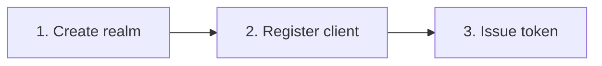

# NativeOpenApi

[](https://www.nuget.org/packages/NativeOpenApi)
[](https://opensource.org/licenses/MIT)

OpenAPI 3.1 primitives for Native AOT .NET 10 — document loading, linting,
merging, HTML rendering, and a catalog of UX attributes consumed by
[`NativeLambdaRouter.SourceGenerator.OpenApi`](../NativeLambdaRouter.SourceGenerator.OpenApi/).

- **Version:** `1.8.3`
- **Target:** `net10.0`
- **Namespace root:** `Native.OpenApi`
- **AOT:** zero runtime reflection; serialization through source-generated contexts

---

## API surface at a glance

### Attributes — `Native.OpenApi.Attributes`

#### Wave 1 (v1.7.0)

| Attribute | Target | Purpose | § |
|---|---|---|---|
| `[HideFromDocs(reason?)]` | class/struct | hide operation from generated YAML | F01 |
| `[Deprecated(sunset, alternative, reason)]` | class/struct | emit `deprecated: true` + `x-sunset` + `x-swepay-alternative` + `x-swepay-deprecation-reason` | F03 |
| `[ApiExample(name, summary) { RequestJson, ResponseStatus, ResponseJson, RequestValue?, ResponseValue? }]` (multi-use) | class/struct | wire named examples into `examples` maps; `RequestValue`/`ResponseValue` emit inline `value:` (v1.8.0) | F09 |
| `[ErrorCatalog(typeof(T))]` | class/struct | attach an error-code catalog to the operation | F12 |
| `[ErrorDefinition(code, httpStatus, userMessage, recovery) { DocUrl }]` | field (`const string`) | one entry inside a catalog | F12 |
| `[ApiResponse(statusCode, responseType?, contentType = "application/json")]` (multi-use) | method (handler's `Handle`) | document per-status responses without the `.Produces<T>()` fluent | v1.6.0 |

#### Navigation (v1.8.0) — assembly-level

| Attribute | Constructor | Named properties | Emits |
|---|---|---|---|
| `[assembly: TagMetadata(name)]` | `name` | `Description`, `DisplayName`, `ExternalDocsUrl`, `ExternalDocsDescription` | root `tags[]` with `description`, `x-displayName`, `externalDocs` |
| `[assembly: TagGroup(name, tags[])]` (multi-use) | `name`, `tags` | — | root `x-tagGroups` |
| `[assembly: OpenApiExternalDocs(url)]` | `url` | `Description` | root `externalDocs` |
| `[EndpointExternalDocs(url)]` | `url` | `Description` | operation `externalDocs` |

#### Operation richness (v1.8.0) — class/struct

| Attribute | Constructor | Named properties | Emits |
|---|---|---|---|
| `[CodeSample(lang, source)]` (multi-use) | `lang`, `source` | `Label` | `x-codeSamples[]` |
| `[OperationBadge(name)]` (multi-use) | `name` | `Position`, `Color` | `x-badges[]` |
| `[ScalarStability(Stability.X)]` | `Stability` enum value | — | `x-scalar-stability` (`stable`/`experimental`/`deprecated`) — Scalar-first, no Redoc equivalent |

#### Schema richness (v1.8.0)

| Attribute | Target | Named properties | Emits |
|---|---|---|---|
| `[property: OpenApiProperty]` | property | `Description`, `Example`, `Default`; string: `MinLength`, `MaxLength`, `Pattern`; numeric: `Minimum`, `Maximum`, `ExclusiveMinimum`, `ExclusiveMaximum`, `MultipleOf`; array: `MinItems`, `MaxItems`, `UniqueItems`; Scalar: `Order` → `x-order`, `AdditionalPropertiesName` → `x-additionalPropertiesName` | all matching OpenAPI 3.1 constraint keywords |
| `[OpenApiEnumMember]` on enum fields | field | `Description`, `DisplayName` | parallel `x-enum-descriptions` + `x-enum-varnames` arrays (Scalar-first; no Redoc `x-enumDescriptions` dual-emit) |

DataAnnotations (`[Required]`, `[StringLength]`, `[MinLength]`, `[MaxLength]`, `[Range]`, `[RegularExpression]`) are also read automatically when present on properties.

#### Polymorphism (v1.8.0) — class

| Attribute | Constructor | Emits |
|---|---|---|
| `[OpenApiDiscriminator(propertyName)]` | `propertyName` | `discriminator: { propertyName, mapping }` on the base schema |
| `[OpenApiSubType(typeof(T), discriminatorValue)]` (multi-use) | `subType`, `discriminatorValue` | base: `oneOf: [$ref Sub1, ...]`; sub-type: `allOf: [$ref Base__Core, {own props}]` |

C# inheritance is auto-detected — no attribute needed for `allOf` on subclass schemas.

#### Document-level (v1.8.0) — assembly

| Attribute | Constructor | Named properties | Emits |
|---|---|---|---|
| `[assembly: OpenApiInfo]` | — | `Description`, `Summary`, `TermsOfService`, `ContactName`, `ContactUrl`, `ContactEmail`, `LicenseName`, `LicenseUrl` | rich `info` object (title/version still come from MSBuild) |
| `[assembly: OpenApiServer(url)]` (multi-use) | `url` | `Description` | `servers[]` |

#### Structural (v1.8.0) — class/struct (multi-use unless noted)

| Attribute | Constructor | Named properties | Emits |
|---|---|---|---|
| `[QueryParameter(name, parameterType?)]` | `name`, `parameterType` | `Required`, `Description` | `parameters: [{ in: query }]` |
| `[HeaderParameter(name, parameterType?)]` | `name`, `parameterType` | `Required`, `Description` | `parameters: [{ in: header }]` |
| `[ResponseHeader(statusCode, name, headerType?)]` | `statusCode`, `name`, `headerType` | `Required`, `Description` | `responses.{status}.headers` |
| `[ResponseLink(statusCode, linkId)]` | `statusCode`, `linkId` | `OperationId`, `Parameters`, `Description` | `responses.{status}.links` |
| `[Callback(name)]` | `name` | `Expression`, `Method`, `Summary`, `PayloadType` | operation `callbacks` (minimal form) |

#### Structural (v1.8.0) — assembly

| Attribute | Constructor | Named properties | Emits |
|---|---|---|---|
| `[assembly: Webhook(name, typeof(Payload))]` (multi-use) | `name`, `payloadType` | `Method`, `Summary`, `Description` | top-level `webhooks:` (payload schema registered in `components/schemas`) |

### Fluent extension — `Native.OpenApi.Extensions`

| Method | Effect |
|---|---|
| `.ExcludeFromDocs()` | route-level sibling of `[HideFromDocs]`; identity pass-through at runtime, compile-time marker for the generator |

### Models — `Native.OpenApi.Models`

| Type | Role |
|---|---|
| `SwepayProblemDetails` | RFC 9457 superset (`code`, `recovery`, `requestId`); generator auto-injects the matching `components.schemas` entry whenever any operation serves `application/problem+json` without a typed body (F13) |

### Rendering — `Native.OpenApi.Rendering`

| Type | Role |
|---|---|
| `OpenApiRendererOptions` | aggregate; `.Default` = pre-Wave-1 behaviour (no brand, no footer, no Mermaid); add `ScalarViewer` for v1.8.0 Scalar knobs |
| `OpenApiBrandingOptions` | `PrimaryColor`, `AccentColor`, `LogoUrl`, `FaviconUrl`, `FontFamily`, `ThemeJsonOverride` |
| `OpenApiFooterOptions` | `StatusUrl`, `SupportUrl`, `ChangelogUrl`, `SlaUrl`, `TermsUrl` |
| `OpenApiScalarViewerOptions` (v1.8.0) | Scalar viewer knobs: `Theme`, `DarkMode`, `Layout`, `HideModels`, `HideDownloadButton`, `HideSidebar`, `HideTestRequestButton`, `DefaultHttpClientTargetKey`, `DefaultHttpClientClientKey`, `LocalAssetPath` |

### Core classes

| Class | Role |
|---|---|
| `OpenApiHtmlRenderer` | renders Redoc + Scalar HTML; each method has a two-arg overload (legacy) and a three-arg `options` overload |
| `OpenApiDocumentLoaderBase` | base for embedded-resource spec loading (JSON + YAML) |
| `OpenApiDocumentMerger` | merges partial specs into a single document |
| `OpenApiDocumentProvider` | orchestrates load → merge → lint |
| `OpenApiLinter` | validates against `OpenApiLintOptions` rules |
| `OpenApiResourceReader` | reads embedded resources from an assembly |
| `IGeneratedOpenApiSpec` | polymorphic access to generator output (implemented automatically when this package is referenced) |

---

## Installation

```bash
dotnet add package NativeOpenApi
```

## Quick reference — Wave 1 (v1.7.0)

### Hide endpoints from docs — F01

```csharp
[HideFromDocs("internal ops endpoint")]
public sealed record InternalHealthCommand(string Secret);
```

Or at the route level (handy when the same command is mapped to several paths and only one should be hidden):

```csharp
using Native.OpenApi.Extensions;

routes.MapGet<ListUsersCommand, ListUsersResponse>("/v1/admin/internal/users", ...)
      .ExcludeFromDocs();
```

**Effect:** the operation never appears in `paths:`. If every operation on a path is hidden, the path itself is dropped.

### Deprecation — F03

```csharp
[Deprecated(
    sunset: "2026-12-31",
    alternative: "POST /v2/orders",
    reason: "v1 doesn't support split payments.")]
public sealed record CreateOrderV1Command(...);
```

**Emits:**

```yaml
deprecated: true
x-sunset: "2026-12-31"
x-swepay-alternative: "POST /v2/orders"
x-swepay-deprecation-reason: "v1 doesn't support split payments."
```

### Named examples — F09

```csharp
[ApiExample(
    name: "happy-path",
    summary: "Simple order with 1 item",
    RequestJson = "examples/create-order/happy.json",
    ResponseStatus = 201,
    ResponseJson = "examples/create-order/happy-response.json")]
[ApiExample(
    name: "validation-error",
    summary: "Invalid CNPJ",
    ResponseStatus = 422,
    ResponseJson = "examples/create-order/invalid-cnpj.json")]
public sealed record CreateOrderCommand(...);
```

Examples reference their JSON payload through `externalValue` (inline payload reading is a Wave 2 follow-up — see [docs/CHANGELOG.md](../../docs/CHANGELOG.md)).

### Error catalog — F12

Declare once:

```csharp
public static class SwepayErrors
{
    [ErrorDefinition(
        code: "PAYMENT_INSUFFICIENT_FUNDS",
        httpStatus: 402,
        userMessage: "Saldo insuficiente no método de pagamento.",
        recovery: "Tente outro método de pagamento ou adicione saldo.",
        DocUrl = "https://docs.swepay.com.br/errors/PAYMENT_INSUFFICIENT_FUNDS")]
    public const string PaymentInsufficientFunds = "PAYMENT_INSUFFICIENT_FUNDS";
}
```

Wire on commands:

```csharp
[ErrorCatalog(typeof(SwepayErrors))]
public sealed record CreatePaymentCommand(...);
```

**Emits at document root:**

```yaml
x-swepay-error-catalog:
  - code: "PAYMENT_INSUFFICIENT_FUNDS"
    httpStatus: 402
    userMessage: "Saldo insuficiente no método de pagamento."
    recovery: "Tente outro método de pagamento ou adicione saldo."
    docUrl: "https://docs.swepay.com.br/errors/PAYMENT_INSUFFICIENT_FUNDS"
```

**Per operation** (the generator slices only codes whose `httpStatus` matches a declared response on that operation):

```yaml
x-swepay-errors:
  - "PAYMENT_INSUFFICIENT_FUNDS"
```

### Canonical `problem+json` schema — F13

When any operation advertises `application/problem+json` **without** a typed body, the generator injects:

```yaml
components:
  schemas:
    SwepayProblemDetails:
      type: object
      properties: { type, title, status, detail, instance, code, recovery, requestId }
      required: [type, title, status, detail, code, recovery, requestId]
```

Two ways to opt in:

```csharp
// (a) fluent — no typed body
routes.MapPost<CreateOrderCommand, CreateOrderResponse>("/v1/orders", ...)
      .ProducesProblem(422);

// (b) handler attribute — null responseType
public sealed class CreateOrderHandler : IRequestHandler<CreateOrderCommand, CreateOrderResponse>
{
    [ApiResponse(422, null, "application/problem+json")]
    public ValueTask<CreateOrderResponse> Handle(...) => ...;
}
```

### Renderer options — F15 / F16 / F17

```csharp
using Native.OpenApi;
using Native.OpenApi.Rendering;

var options = new OpenApiRendererOptions
{
    Branding = new OpenApiBrandingOptions
    {
        PrimaryColor = "#0A2540",
        AccentColor  = "#00D4AA",
        LogoUrl      = "https://cdn.swepay.com.br/brand/logo-dark.svg",
        FaviconUrl   = "https://cdn.swepay.com.br/brand/favicon.ico",
        FontFamily   = "Inter, Roboto, sans-serif"
    },
    Footer = new OpenApiFooterOptions
    {
        StatusUrl     = "https://status.swepay.com.br",
        SupportUrl    = "https://docs.swepay.com.br/support",
        ChangelogUrl  = "https://docs.swepay.com.br/changelog",
        SlaUrl        = "https://docs.swepay.com.br/sla",
        TermsUrl      = "https://docs.swepay.com.br/terms"
    },
    EnableMermaid        = true,   // F17 — render fenced ```mermaid blocks as SVG
    MermaidFromLocalAsset = false  // true for air-gapped deployments (serves ./assets/mermaid.min.js)
};

var renderer = new OpenApiHtmlRenderer();
var redocHtml  = renderer.RenderRedoc ("/docs/openapi.json", "My API", options);
var scalarHtml = renderer.RenderScalar("/docs/openapi.json", "My API", options);
```

The legacy `RenderRedoc(spec, title)` / `RenderScalar(spec, title)` overloads are preserved (RFC principle **O5**).

**Mermaid in descriptions** — any fenced ` ```mermaid ` block inside `summary`/`description` text becomes inline SVG when `EnableMermaid = true`. Example description body:

````markdown
## Flow


````

---

## Quick reference — v1.8.0

### Tag groups and tag metadata

```csharp
// ApiDocumentation.cs (assembly-level declarations)
[assembly: OpenApiInfo(
    Description    = "Marketplace API — manage items, subscriptions and payments.",
    Summary        = "Marketplace API",
    TermsOfService = "https://example.com/terms",
    ContactName    = "API Support",
    ContactEmail   = "api@example.com",
    LicenseName    = "Apache 2.0",
    LicenseUrl     = "https://www.apache.org/licenses/LICENSE-2.0")]

[assembly: OpenApiServer("https://api.example.com",         Description = "Production")]
[assembly: OpenApiServer("https://sandbox.api.example.com", Description = "Sandbox")]

[assembly: OpenApiExternalDocs("https://docs.example.com", Description = "Developer guide")]

[assembly: TagMetadata("Orders",
    Description  = "Operations related to order lifecycle — creation, updates and cancellation.",
    DisplayName  = "Order Management",
    ExternalDocsUrl         = "https://docs.example.com/orders",
    ExternalDocsDescription = "Order domain guide")]

[assembly: TagGroup("Commerce",       new[] { "Orders", "Products" })]
[assembly: TagGroup("Administration", new[] { "Users",  "Roles"    })]
```

**Emits:**

```yaml
externalDocs:
  description: "Developer guide"
  url: "https://docs.example.com"
tags:
  - name: Orders
    description: "Operations related to order lifecycle — creation, updates and cancellation."
    x-displayName: "Order Management"
    externalDocs:
      description: "Order domain guide"
      url: "https://docs.example.com/orders"
x-tagGroups:
  - name: Commerce
    tags: [Orders, Products]
  - name: Administration
    tags: [Users, Roles]
```

### Code samples, badges and stability

```csharp
[CodeSample("curl",
    source: """
    curl -X POST https://api.example.com/v1/orders \
         -H "Authorization: Bearer {token}" \
         -H "Content-Type: application/json" \
         -d '{"customerId":"cus_123","amount":49.90}'
    """,
    Label = "cURL")]
[CodeSample("csharp",
    source: "var resp = await http.PostAsJsonAsync(\"/v1/orders\", cmd);",
    Label = "C# (HttpClient)")]
[OperationBadge("beta",     Position = "after", Color = "#e5a505")]
[OperationBadge("internal", Color    = "#888")]
[ScalarStability(Stability.Experimental)]
public sealed record CreateOrderCommand(string CustomerId, decimal Amount);
```

**Emits:**

```yaml
x-codeSamples:
  - lang: curl
    label: "cURL"
    source: |
      curl -X POST https://api.example.com/v1/orders \
           -H "Authorization: Bearer {token}" \
           -H "Content-Type: application/json" \
           -d '{"customerId":"cus_123","amount":49.90}'
  - lang: csharp
    label: "C# (HttpClient)"
    source: "var resp = await http.PostAsJsonAsync(\"/v1/orders\", cmd);"
x-badges:
  - name: beta
    position: after
    color: "#e5a505"
  - name: internal
    color: "#888"
x-scalar-stability: experimental
```

### Polymorphic payment method (oneOf + discriminator)

```csharp
[OpenApiDiscriminator("kind")]
[OpenApiSubType(typeof(CreditCardPayment), "credit_card")]
[OpenApiSubType(typeof(PixPayment),        "pix")]
public abstract class PaymentMethod
{
    public string Kind { get; set; } = "";
}

public sealed class CreditCardPayment : PaymentMethod
{
    public string CardToken { get; set; } = "";
    public int    Installments { get; set; }
}

public sealed class PixPayment : PaymentMethod
{
    public string PixKey { get; set; } = "";
}
```

**Emits:**

```yaml
components:
  schemas:
    PaymentMethod:
      oneOf:
        - $ref: '#/components/schemas/CreditCardPayment'
        - $ref: '#/components/schemas/PixPayment'
      discriminator:
        propertyName: kind
        mapping:
          credit_card: '#/components/schemas/CreditCardPayment'
          pix:         '#/components/schemas/PixPayment'
    PaymentMethod__Core:
      type: object
      properties:
        kind:
          type: string
    CreditCardPayment:
      allOf:
        - $ref: '#/components/schemas/PaymentMethod__Core'
        - type: object
          properties:
            cardToken:
              type: string
            installments:
              type: integer
              format: int32
    PixPayment:
      allOf:
        - $ref: '#/components/schemas/PaymentMethod__Core'
        - type: object
          properties:
            pixKey:
              type: string
```

### Scalar viewer configuration

```csharp
var options = new OpenApiRendererOptions
{
    Branding = new OpenApiBrandingOptions { PrimaryColor = "#0A2540", LogoUrl = "https://cdn.example.com/logo.svg" },
    ScalarViewer = new OpenApiScalarViewerOptions
    {
        Theme                      = "midnight",
        DarkMode                   = true,
        Layout                     = "sidebar",
        HideModels                 = false,
        HideDownloadButton         = false,
        HideSidebar                = false,
        HideTestRequestButton      = false,
        DefaultHttpClientTargetKey = "Shell",
        DefaultHttpClientClientKey = "curl"
        // LocalAssetPath = "./assets/scalar.js"  // air-gap only
    }
};

var html = renderer.RenderScalar("/docs/openapi.yaml", "My API", options);
```

---

## Minimal document pipeline

### 1. Loader

```csharp
public class MyOpenApiDocumentLoader : OpenApiDocumentLoaderBase
{
    public MyOpenApiDocumentLoader(OpenApiResourceReader reader) : base(reader) { }

    public override IReadOnlyList<OpenApiDocumentPart> LoadCommon() => new[]
    {
        Load("common-schemas",   "openapi/common/schemas.yaml"),
        Load("common-responses", "openapi/common/responses.yaml"),
        Load("common-security",  "openapi/common/security.yaml"),
    };

    public override IReadOnlyList<OpenApiDocumentPart> LoadPartials() => new[]
    {
        Load("users",    "openapi/users/openapi.yaml"),
        Load("products", "openapi/products/openapi.json"),
    };
}
```

### 2. Merger (optional)

```csharp
public class MyOpenApiDocumentMerger : OpenApiDocumentMerger
{
    protected override string GetServerUrl()
        => Environment.GetEnvironmentVariable("ENVIRONMENT") switch
        {
            "prd" => "https://api.swepay.com.br",
            "hml" => "https://sandbox.api.swepay.com.br",
            _     => "https://localhost:5001"
        };

    protected override string GetApiTitle()       => "Swepay API";
    protected override string GetApiDescription() => "Consolidated OpenAPI spec for partner integrations.";
}
```

### 3. Provider

```csharp
var reader   = new OpenApiResourceReader(typeof(Program).Assembly, "MyApp.");
var loader   = new MyOpenApiDocumentLoader(reader);
var merger   = new MyOpenApiDocumentMerger();
var linter   = new OpenApiLinter(OpenApiLintOptions.Empty);
var provider = new OpenApiDocumentProvider(loader, merger, linter);

provider.WarmUp();

var json = provider.Document.Json;
var yaml = provider.Document.Yaml;
```

---

## Linting

```csharp
var options = new OpenApiLintOptions(
    RequiredErrorResponses: ["400", "401", "500"],
    SensitiveFieldNames:    ["password", "token", "secret"],
    DisallowedGenericSegments: ["data", "items"]);

var linter = new OpenApiLinter(options);
```

Checks:

- OpenAPI version is `3.1.0`
- Every path is versioned (e.g. `/v1/`)
- Every operation has a security block (or explicit `security: []` for anonymous)
- Required error responses are declared
- Sensitive fields carry a description

---

## `[ApiResponse]` on handler methods (v1.6.0+)

Co-locate per-status responses with the handler:

```csharp
using Native.OpenApi;
using NativeMediator;

public class GetProductHandler : IRequestHandler<GetProductCommand, GetProductResponse>
{
    [ApiResponse(200, typeof(GetProductResponse))]
    [ApiResponse(404, typeof(ErrorResponse))]
    [ApiResponse(400, typeof(ProblemDetails), "application/problem+json")]
    [ApiResponse(422, null,                  "application/problem+json")]   // → SwepayProblemDetails (F13)
    public ValueTask<GetProductResponse> Handle(GetProductCommand r, CancellationToken ct) { ... }
}
```

| Parameter | Type | Default | Purpose |
|---|---|---|---|
| `statusCode` | `int` | — | HTTP status |
| `responseType` | `Type?` | `null` | typed body; when `null` + `application/problem+json`, the generator points at `SwepayProblemDetails` |
| `contentType` | `string` | `"application/json"` | content type |

---

## Native AOT

```xml
<PropertyGroup>
  <PublishAot>true</PublishAot>
  <IsAotCompatible>true</IsAotCompatible>
  <IsTrimmable>true</IsTrimmable>
</PropertyGroup>
```

All JSON/YAML serialization flows through source-generated `JsonSerializerContext`. No runtime reflection on consumer types.

---

## Related

- [NativeLambdaRouter.SourceGenerator.OpenApi](../NativeLambdaRouter.SourceGenerator.OpenApi/) — Roslyn generator that reads the attributes above
- [Root repository](../../) · [Changelog](../../docs/CHANGELOG.md) · [UX RFC](../../docs/RFC-DOCUMENTACAO-UX.md)

## License

MIT
